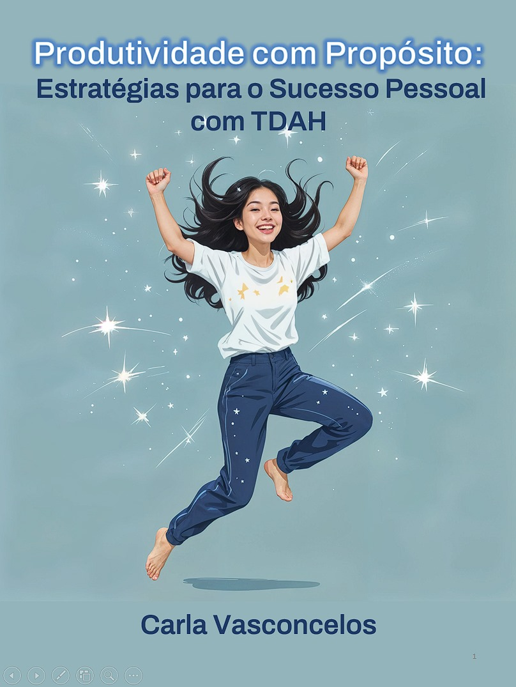

    

# Projeto EBOOK Gerado por I.A.

> ℹ️ **NOTE:** Este é o repositório desenvolvido durante a criação do meu eBook "Produtividade com Propósito: Estratégias para o Sucesso Pessoal com TDAH"

Projeto com o objetivo de gerar um eBook digital utilizando ferramentas de IA. Todos os prompts utilizados seguem abaixo.

<a href="https://github.com/VasconcelosCarla/prompts-recipe-to-create-a-ebook/blob/main/output/ebook%20-%20Produtividade%20com%20Proposito%20output.pdf" title="View PDF now"> 📕Clique aqui para ler</a>

## 💻 Tecnologias utilizadas no projeto

- [ChatGPT](https://chat.openai.com/)
- [Leonardo.Ai](https://www.leonardo.ai/)
- [Canva](https://www.canva.com/)
- [PowerPoint](https://www.microsoft.com/en/microsoft-365/powerpoint?market=af)

## 🧠 Prompts

### ChatGPT

|   Ação   | Prompt                                                                                                                      |
|:--------:|-----------------------------------------------------------------------------------------------------------------------------|
|  Título  | Crie um título de um eBook sobre estratégias para o sucesso pessoal com TDAH, focado em métodos que aumentem a dopamina de forma gradativa, com um tom encorajador e motivacional. |
| Conteúdo | Faça um texto para eBook, com foco em estratégias para gerenciamento pessoal para pessoas com TDAH, trazendo métodos com recompensas para o aumento de dopamina gradativamente, para que uma pessoa com TDAH consiga estabelecer e concluir metas. Liste os principais métodos. |

### Leonardo.Ai

|  Ação   | Prompt                                                                                                      |
|:-------:|-------------------------------------------------------------------------------------------------------------|
| Título  | Uma figura estilizada ou ilustração de uma pessoa em um momento de euforia ou conquista, simbolizando uma pequena vitória. |

## ✨ Features

- Conteúdo gerado via ChatGPT
- Imagens geradas via Leonardo.Ai e Canva

## 📚 Materiais

- Imagens utilizadas em `assets`
- eBook gerado durante a criação em `output`

## 🛠️ Instruções de execução

Utilize os prompts acima nas ferramentas sugeridas para gerar o material base e utilize uma ferramenta de edição de documentos como PowerPoint, LibreOffice ou Canva para diagramação.

## ✨ Autora

    
    
&nbsp&nbsp&nbspCarla Vasconcelos 
    &nbsp&nbsp&nbsp<a href="https://github.com/VasconcelosCarla">GitHub</a>&nbsp;|&nbsp;
    <a href="https://www.linkedin.com/in/carla-vasconcelos-9192b221/">LinkedIn</a>&nbsp;|&nbsp;
    <a href="https://www.instagram.com/profcarlavasconcelos?utm_source=qr&igsh=OWxkbGw2bWh1Z2Yx">Instagram</a>&nbsp;|&nbsp;
    

  

---

⌨️ com 💜 por [Carla Vasconcelos](https://github.com/VasconcelosCarla)
